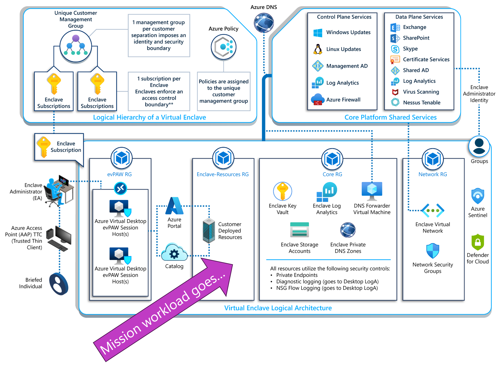

## Enclave Administrator - Learning Path 1 - Module 1

### Agenda
* Module 1 - What is the PLx and Enclave environment?
    * What are the differences from Commercial Cloud?
    * What does the architecture look like?
    * What are virtual enclaves?
    * What is the Enclave Administrator role?

### Module 1 - What is the PLx and Enclave environment?

Watch this video to learn about the basics of PLx and the Enclave architecture.

#### Protection Level X (PLx) Overview

PLx is an end-to-end managed service offering within the Azure Secret and Azure Top Secret clouds that enables rapid provisioning of highly secure environments for Special Access Program (SAP) workloads.

The PLx platform replaces the environments that SAP users needed to design, build, deploy, and configure for each mission capability set.

These individual systems are replaced by a stacked architecture of Protection Level 2 (PL-2) systems in the Azure DoD cloud.  This enables users to securely use the same application (e.g. Matlab) for multiple mission sets at different classifications. This approach greatly cuts cost and labor requirements, and significantly enhances ease of use by requiring users to use only one system, instead of many, for all their mission needs.

The Protection Level "X" ecosystem for Special Access Program workloads starts at the PL-2 level of the stacked architecture.  There are also the following protection level categories and classifications.
- **Devices** - PL-4 - these are the Azure Access Points to the mission sets.
- **Connection** - Global Mission Connectivity
- **Platform** - PL-3 - this is the cloud with desktop and collaboration.
- **Software** - PL-2 or PL-3 - Azure Virtual Enclaves for isolation.
- **Data movement** - PL-5 - Azure data transfer
- **Authorization** - PL-2, PL-3, PL-4, PL-5 - for different types of authorization.
- **Operations** - PLx-as-a-Service for network operations center (NOC), security operations center (SOC), and Service desk.

Here is an image showing the different levels and categories of the PLx SAP ecosystem:

#### What are the differences in Azure Gov Cloud from commercial cloud?

Microsoft Azure Government uses same underlying technologies as global Azure, which includes the core components of Infrastructure-as-a-Service (IaaS), Platform-as-a-Service (PaaS), and Software-as-a-Service (SaaS). Both Azure and Azure Government have the same comprehensive security controls in place and the same Microsoft commitment on the safeguarding of customer data. Whereas both cloud environments are assessed and authorized at the FedRAMP High impact level, Azure Government provides an extra layer of protection to customers through contractual commitments regarding storage of customer data in the United States and limiting potential access to systems processing customer data to screened US persons. These commitments may be of interest to customers using the cloud to store or process data subject to US export control regulations.

More information can be found at this link: https://learn.microsoft.com/en-us/azure/azure-government/compare-azure-government-global-azure

##### PLx Ecosystem and Shared Responsibility

Similar to the Azure commercial cloud and IaaS, PaaS, or SaaS solutions, PLx has a shared responsibility model within its managed services.

The following figure shows the different responsiblities that could fall under different personas of PLx services.

##### Enterprise Special Access Program (SAP) Environment

The shared responsibilities of the ecosystem are the foundation to the PLx managed services.  These managed services include:
- **Endpoints** - Azure access point managed services - Hardware-as-a-Services for user endpoints providing access to classified virtual desktops and applications.
- **Connectivity** - Network-as-a-Service (NaaS) - Network connectivity from site-to-cloud as a managed service by Microsoft.
- **Data movement** - Azure data transfer - Microsoft authorized and managed RTB compliant cross domain solution.
- **Workloads** - Azure Virtual Enclaves - platform native, SAP-compliant, self-managed isolation using Azure Virtual Desktop.  Provides a flexibility to install and manage software, workloads, and data.

The following figure shows the enterprise architecture of the SAP environment.

#### What does the PLx and Enclave architecture look like?

Access to the PLx resources and application sets are accomplished using Privileged Access Workstations (PAW) that access Azure Virtual Desktop environments, or Virtual Enclaves.  The types of PAW are defined in the following categories:
- **Virtual PAW (vPAW)**: Although not available to customers, this desktop provides the administrative desktop for conducting action by service desk, operations, and engineering.
- **Enclave Virtual PAW (evPAW)**: The primary conduit for EAs to conduct their administrative actions inside their enclave.
- **Common Desktop**: Provides a managed Protection Level 3 (PL-3) environment that enables users from different Virtual Enclaves to securely collaborate. This capability comes with an Authority to Operate (ATO) from the customer.
    - Users gain access to collaborative tools such as Microsoft Exchange, SharePoint, Office, Adobe Acrobat DC, and more.
    - Files on the Common Desktop are protected with Sentris, which restricts access based on Attribute-Based Access Control (ABAC). Users will only see data relevant to them.

The following figure shows the different layers of access to these PAW types.

Common desktops will use a managed Azure Virtual Desktop service to access the virtual Enclave through a remote desktop (RDP) connection.

The following figure shows the managed Azure Virtual Desktop service to access the virtual Enclave through a remote desktop (RDP) connection.

The PLx managed service provides access to secure cloud environments for sensitive mission workloads

The following figure shows the managed services access point to supporting mission workloads.

The PL-3 mission app framework provides isolation with desktop and collaboration integration. The PL-3 mission app framework provides isolation with desktop and collaboration integration.

The following figure shows the PL-3 reference architecture pattern.

A **PLx Virtual Enclave** is a logical unit that provides the necessary controls to support and properly segment DoD SAP workloads and data. 

Most of these controls are not modifiable by EAs. However, a robust understanding of the default infrastructure is critical to the successful development and deployment of additional customer workloads.

The following figure shows the PLx Enclave logical architecture.

##### Enclave Administrator role

The Enclave Administrator has the responsibility to manage resources and health of everything inside their enclave boundaries.

These functions are:
- Ensuring systems are operational

- Managing / patching operating systems

- Rights, permissions, and assignments (AD administration including user management and Azure RBAC for resources relating to the enclave)

- Creating and managing Azure resources within the Enclave

- CONOPS

The following figure shows how the Enclave Administrator would access the environment.

Responsiblities of an Enclave Administrator include:

- Ensuring systems are operational

- Managing / patching operating systems

- Rights, permissions, and assignments 
    (AD administration including user management and Azure RBAC for resources relating to the enclave)

- Creating and managing Azure resources within the Enclave

- Patching: EAs are responsible for manually retrieving, installing, and deploying OS patches as well as checking if patching succeeded and whether the system remains operational. This includes all VMs within the enclave including evPAWs.
**Note**: The Common Desktop is managed by SOI. An Animal enclave EA is not responsible for the Common Desktop host pool operating systems.

- Disk management: EAs will manage disk storage for applications.

- AD Administration (as it applies to the Enclave-delegated OU): Each enclave has delegated rights to an enclave specific OU within the Enterprise AD. The EA is responsible for rights, permissions, assignments, and custom GPOs.

- STIG Compliance: 
    - Windows: VMs joined to the Enterprise AD domain will inherit the Enterprise GPO to facilitate baseline STIG requirements. 
    - Linux: While the manage service maintain a small selection of CentOS repos, it does not provide common YUM/DNF/APT/... repos in general. Plan to host and maintain your own repos. 

- Mission Resources: EAs can create or remove Azure resources within a subscription, such as Virtual Machines (VMs) and other allowed Azure capabilities.

- CONOPS: Audit reviews, incident response, configuration management, and contingency plans (e.g. backup strategy)

- Service Desk Engagement

